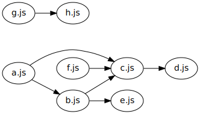

# Find Entry Points

[](https://www.npmjs.com/package/find-entry-points)

> Find the entry points in a set of JavaScript files.

## Install

Supports Node.js versions 10 and above.

```sh
$ npm i find-entry-points
```

## Huh?

### Example 1

Given a sync or async iterable of paths to the JavaScript files with the following dependencies between them (a directed arrow from `a.js` to `b.js` means `a.js` imports `b.js`):


This package would return `[['a.js']]` because `a.js` is the entry point of the above JavaScript library or application (it is not imported by any JavaScript file).

## Example 2

Given a sync or async iterable of paths to the JavaScript files with the following dependencies between them:



This package would return `[['a.js'], ['f.js'], ['g.js']]` (order not guaranteed) because `a.js`, `f.js`, and `g.js` are all not imported by any JavaScript file. Notice that it is possible to have a disconnected dependency graph.

## Example 3

Given a sync or async iterable of paths to the JavaScript files with the following dependencies between them:


This package would return `[['a.js'], ['g.js']]` (order not guaranteed). Notice that cycles are possible because imports are cached.

### Example 4

Given a sync or async iterable of paths to the JavaScript files with the following dependencies between them:


This package would return `[['a.js'], ['g.js', 'h.js', 'i.js']]` (order not guaranteed). Notice that this is the first example where an inner array contains more than one element. This is because `g.js`, `h.js`, and `i.js` are all valid entry points for their graph component.

## Usage

Suppose the JavaScript files with the following dependencies between them are all in a `src` directory and that `h.js` imports `i.js` via a dynamic import:


```js
import { findEntryPoints, findSingleEntryPoints } from 'find-entry-points'
import globby from 'globby'
import * as swc from '@swc/core'

const main = async () => {
  // `globby.stream` returns an async iterable of file paths
  console.log(await findEntryPoints(globby.stream('src/*.js')))
  //=> [['src/a.js'], ['src/g.js', 'src/h.js', 'src/i.js']]

  // `findSingleEntryPoints` ignores cyclic entry points
  console.log(await findSingleEntryPoints(globby.stream('src/*.js')))
  // => ['src/a.js']

  console.log(
    await findEntryPoints(globby.stream('src/*.js'), {
      followDynamicImports: false
    })
  )
  //=> [['src/a.js'], ['src/i.js']]

  console.log(
    await findSingleEntryPoints(globby.stream('src/*.js'), {
      followDynamicImports: false
    })
  )
  // => ['src/a.js', 'src/i.js']

  // Use the `transform` option to transform non-standard syntax
  // like JSX to standard ECMAScript so that imports can be parsed
  console.log(
    await findEntryPoints(globby.stream('src/*.js'), {
      transform: async ({ path, code }) =>
        (
          await transform(code, {
            filename: path,
            jsc: { parser: { jsx: true } }
          })
        ).code
    })
  )
  //=> [['src/a.js'], ['src/g.js', 'src/h.js', 'src/i.js']]
}

main()
```

See [the commented type definitions](https://github.com/TomerAberbach/find-entry-points/blob/master/src/index.d.ts) for clarification.

## How?

The package uses [`parse-imports`](https://github.com/TomerAberbach/parse-imports) (another package of mine) to construct a dependency graph, which is a [directed graph](<https://en.wikipedia.org/wiki/Graph_(discrete_mathematics)#Directed_graph>), from the given set of JavaScript files. Then the package finds the [strongly connected components](https://en.wikipedia.org/wiki/Strongly_connected_component) of the dependency graph using [Tarjan's strongly connected components algorithm](https://en.wikipedia.org/wiki/Tarjan%27s_strongly_connected_components_algorithm), and constructs a [directed acyclic graph from the strongly connected components](https://en.wikipedia.org/wiki/Strongly_connected_component#Definitions:~:text=If%20each%20strongly%20connected%20component%20is,contains%20at%20least%20one%20directed%20cycle.). Finally, the package returns the strongly connected components corresponding to the [vertices](<https://en.wikipedia.org/wiki/Vertex_(graph_theory)>) with [in-degree](https://en.wikipedia.org/wiki/Directed_graph#Indegree_and_outdegree) 1 in the new directed acyclic graph.

## Contributing

Stars are always welcome!

For bugs and feature requests, [please create an issue](https://github.com/TomerAberbach/find-entry-points/issues/new).

For pull requests, please read the [contributing guidelines](https://github.com/TomerAberbach/find-entry-points/blob/master/CONTRIBUTING.md).

## License

[Apache 2.0](https://github.com/TomerAberbach/find-entry-points/blob/master/LICENSE)

This is not an official Google product.
